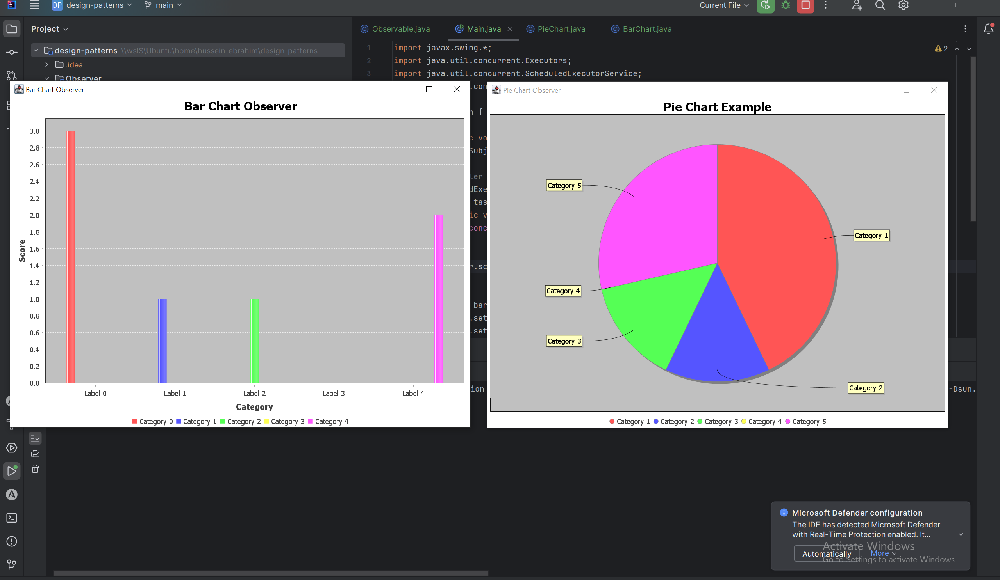

The Observer Design Pattern:
     

<li> It is a behavioral pattern that solves the challenge of the polling of data
<li> Central publisher (subject/observable) publish his state to multiple observers
<li> The Observer is interested in the data to change it's state or shape.
<li> Each subject has a list of observers and whenever it's data change he notifies all his observers.
<li>
    There are two variants of this pattern :
    <ol>
        <li>
            Pushing-Polling: here the subject pushes the notification to all observers, then now it is there responsibility 
to poll the data from the subject in that case
<strong>Referencing the ConcreteSubject from the ConcreteObserver is a MUST.</strong>
        <li>
            Pushing-Pushing: This variant is the subject pushes the update notification to the observers, and it sends the data as well.
        <strong>Referencing the ConcreteSubject from the ConcreteObserver is not required.</strong>
    </ol>

This is a simple implementation of the Observer pattern, in which the subject is an array of numbers and the observers are 
Barchart and a PieChart listening on the data for any changes to visualize.
   

